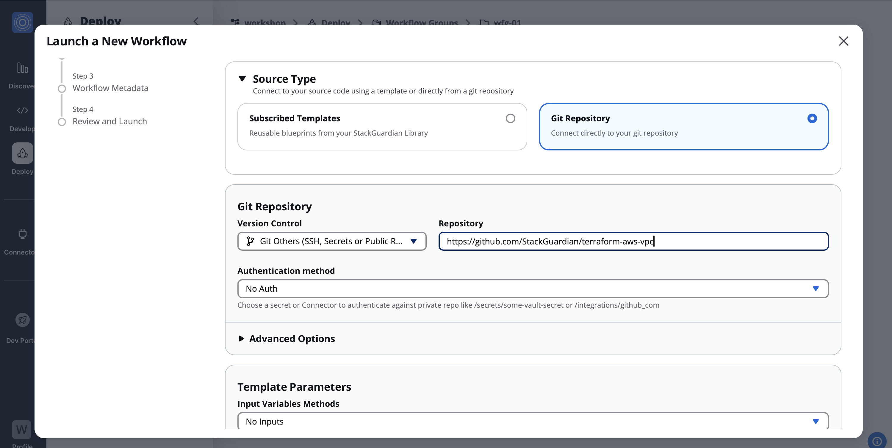

# UseCase 1 - Deployment from repository

## Overview - What's in the section?
Time: ~10 minutes

In this section, we are going to explore the StackGuardian platform and also prepare the environment for the current and upcoming sections. The task for usecase 1 is to deploy a AWS VPC from an existing github repository. This will touch following capabilities of our platform: 

* SG builds a pipeline to deploy resources in Cloud
* Check infrastructure for misconfiguration
* Manage Terraform State
* Approval for workflows
* Schedule to build and destroy infrastructure

_Fig. Deploy directly from existing repository_

## 1.1 - Setup the environment
### Description
Login to StackGuardian platform on https://app.stackguardian.io/. You should have received the invitation to the organisation called 'workshop' via email (check also your spam folder). 
If nothing arrived, please let the instructors know and they will be able to help you. 

### Assigned number xx for the workshop
Every participant will receive a two digit number (xx) for the workshop. You will be able to find them in the chat or on the slides of the instructor. Please memorize the number - you will need it throughout the different usecases.

### Create your own Workflow Group
A workflow group is like your own project, where you will be deploying resources into. It is also used to enforce policies later on. 
On the left side of the screen click **Workflow Groups**. In there **Create Workflow Group** with **Resource Name** = ``wfg-xx`` (xx is your assigned number)

If you like, you can add Tags and descriptions to it as well. 

## 1.2 - Deploy AWS VPC from exisiting repository
### Description
In this exercise we will deploy a resource from an existing repository. This should demonstrate, how simple it is to reuse the code that was already written within the organisation. In this case we will use a public repository from StackGuardian, but it could also be a private one.
When filling a form and no specific values are mentioned, then just leave the default values in the field and continue.

### Create workflow

1. Click on your newly created workflow group **wfg-xx** 
2. Click the button **Create Workflow** >> **Use Wizard** >> **Terraform**.
3. Choose **Git Repository**
4. Under Git Repository select **github_com**
5. Repository URL: ``https://github.com/StackGuardian/terraform-aws-vpc`` 
6. Click **Next**

_Fig. Choose Repository to deploy from_
---
7. Choose connector = **AWS-Deploy-Role**
8. Click **Next** 
---
9. **Workflow Name** = ``repo-vpc-xx``
10. The rest leave unchanged.
11. Hit **Next**
---
12. Review the settings and **Launch**
---
13. Choose **Terraform Action: Create** and **Quick Run** to start the deployment.
---

### More points to explore for you and with instructor
After the first exercise you can try the different tabs in the workflow you just created. Also the instructor will go through the following points with the group:

* Approval for workflow
* Schedule create or destroy for specific times
* State management
* Chaining of workflows
* Deploy workflow
