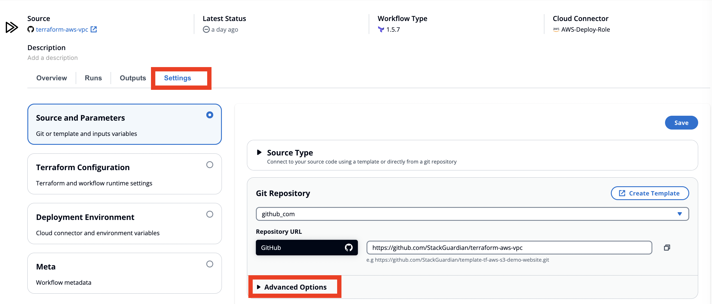
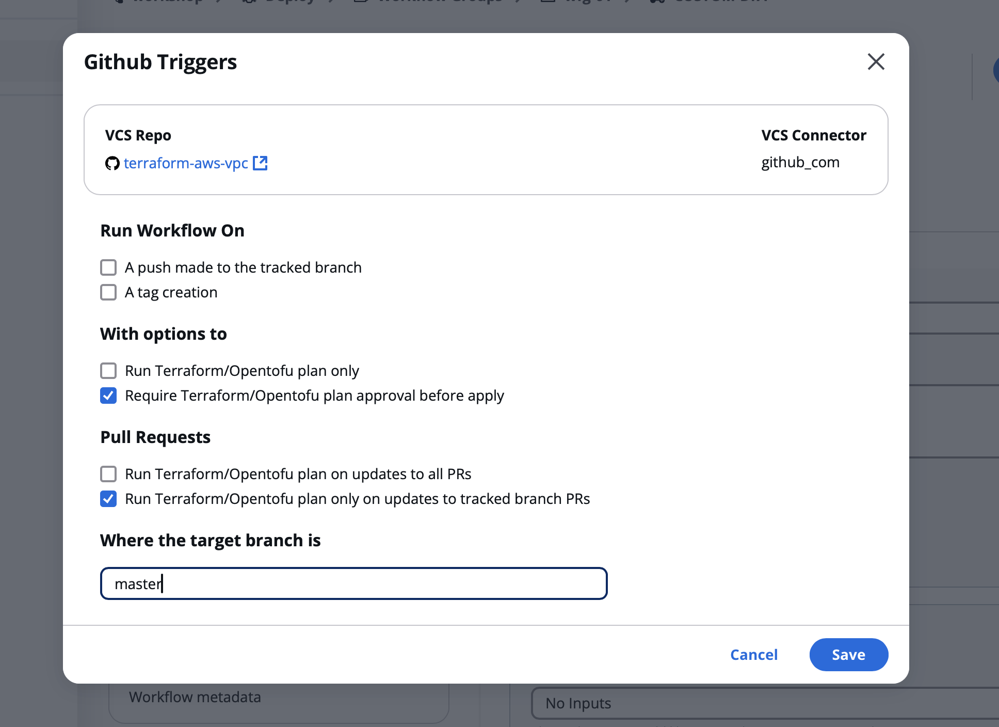

# UseCase 2 - Gitops

## Overview - What's in the section?
Time: ~10 minutes

GitOps is build on the idea that the entire infrastructure and application lifecycle is managed through Git repositories as the single source of truth.
In this section, we are going to work git centric. 

* Configure git triggers in StackGuardian
* Create pull requests in git
* Triggered deployment in SG
* Receive results from deployment, cost calculation and policy evaluation directly in git

## 2.1 - Configure github triggers
### Description
This section shows how deployments and tests can be started from git.

### Setup triggers
Let's navigate to your existing workflow from the first usecase by choosing **Workflow Groups** in the sidebar. 
Select your workflow group **wfg-xx**, and then the workflow **repo-vpc-xx**. 
Choose the tab **Settings** and **Advanced Options**. 

_Fig. Open Advanced Options for Github Triggers_

Scroll down to the button **Configure Github Triggers**. 

Now configure the triggers as shown in the image below. 

_Fig. Configure Github Triggers_

### What is the effect of triggers
By setting the triggers the following will happen:
* Each time a pull request towards the tracked branch ('master') is created, the workflow will run
* The triggered run will deploy the resources (in this case a vpc) in the cloud but will ask for an approval before the deployment to the cloud
* A paragraph with comments will be posted in the github pull request to inform the git user about the outcome of the run

### Pull request
Once all participants completed the setup, your StackGuardian Host will share the screen and create the pull request.
This will start your workflow and ask you for your approval. Go ahead and approve the run.
