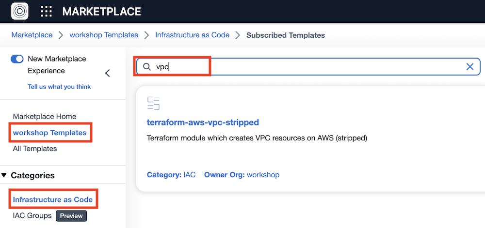
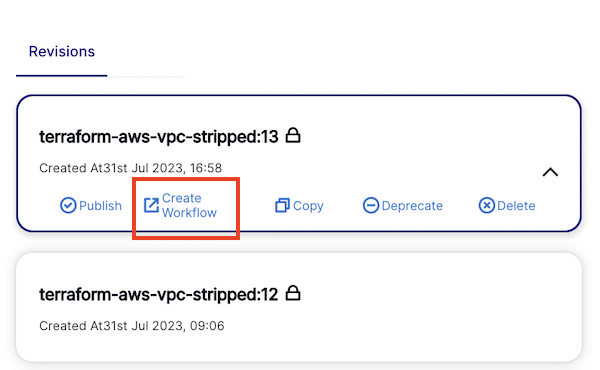

# Usecase 2 - Templates and NoCode

## Overview - What's in the section?
Time: ~30 minutes

In this section, we will begin to make use of the StackGuardian marketplace, which can be seen as a library for templates and blueprints. But it is more than that - it also allows you to manage the version and lifecycle of your IaC templates, across different protocols (like Terraform, Ansible Playbooks, Helm Charts etc..), combine multiple templates/protocols into a stack and use NoCode to deploy them. 
The goal of this use-case is to demonstrate the following:

* Standardize on blueprints and templates
* Collaborate between teams in an organisation
* NoCode Interface to simplify deployment of infrastructure
* Versioning and lifecycle of templates

_Fig. Use the marketplace to manage and deploy templates_

## 2.1 - Create template in marketplace
### Description
in this lab you will see how quickly a new template in the private marketplace can be created.
FYI, in 2.2 will NOT deploy this template but a template that was prepared for the exercise.

### Create template in marketplace
On the left top click on the 9 dots next to Orchestrator and then on **Marketplace**
  
  
_Fig. Marketplace Link_  
  
Once on the marketplace you can try out the different links and then continue to **Create Template +** which you can find on the top right hand side of the screen.

 
_Fig. Create template on marketplace_  

1. Template Name = ``vpc-xx``
2. Scroll down and set Source Config Kind = **TERRAFORM**
3. Source Destination Kind = **github.com**
4. Repository URL = ``https://github.com/StackGuardian/terraform-aws-vpc``
5. On the bottom right of the screen click **Generate No Code Form**
6. By scrolling down you see the variables that were identified in the IaC and loaded into the template.
7. Hit **Create** to add this template to your marketplace.

Later on the instructor will go through the different tabs with the whole group but you can also explore the tabs Usage, Analysis, Code, Meta already now. 
Btw. the **NoCode** tab is used to adjust the generated NoCode interface.

## 2.2 - Deploy an AWS VPC from existing template
### Description
In this exercise you will **NOT** use the previously created template but you deploy a prepared template from the marketplace.  

### Deploy from template
In the marketplace overview select **workshop Templates** and **Infrastructure as Code**. This is the private marketplace for the workshop organisation and only visible to the members of the workshop. 
In the top search bar type ``vpc``. This should show you the **terraform-aws-vpc-stripped** IaC template. Go ahead and check out what is inside.

 
_Fig. VPC template in marketplace_  

Under Meta>Repo you can find the repository, where the IaC is pulled from in each deployment of this template. When you open the **NoCode** tab you can see how the NoCode interface was adapted to the needs of this lab. Only a few paramters need to be set to create the VPC with subnets, routes, internet gateway and many more resources. Modifications to the NoCode form are done under **Show Schema** - A quick way to adapt the graphical interface to non-IaC experts via JSON. 

To deploy the VPC open the latest Revision on the left side and click **Create Workflow**.

 

_Fig. Create VPC from latest revision_  

To create the workflow, fill in following values - remember to substitute the **xx** with your assigned number: 

1. Select Workflow Group = **wfg-xx**
2. Click **Next**
---
3. Workflow Name = **marketplace-vpc-xx**
4. Click **Next**
---
5. Choose Connector = **AWS-Deploy-Role**
6. Click **Next**
---
7. Scroll down and set the textfield: VPC Name = **workshop-vpc-xx**
8. CIDR Block for VPC = _choose one_
9. Public Subnets IP Addresses = _choose one_
10. Private Subnets IP Addresses = _choose one_
11. Click **Save**
---

You created a workflow from a template in the marketplace, but the resources are not yet deployed yet. 

To do so, click the **Play-button** on the top left and afterwards **Run Workflow** in the flyout. 

 

_Fig. Deploy resources via Play-button and Run workflow_ 

In the **Runs** tab you can now follow the deployment. Once the VPC is ready, the Status will change to **Completed**. 

The instructor will show the different capabilities in the marketplace. If you have a usecase in mind, feel free to ask how this can be done in StackGuardian.
