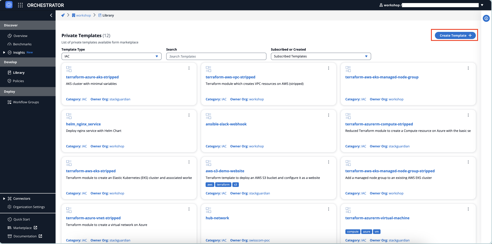
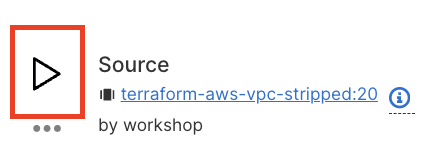

# Usecase 2 - Templates and NoCode

## Overview - What's in the section?
Time: ~30 minutes

In this section, we will begin to make use of the StackGuardian marketplace, which can be seen as a library for templates and blueprints. But it is more than that - it also allows you to manage the version and lifecycle of your IaC templates, across different protocols (like Terraform, Ansible Playbooks, Helm Charts etc..), combine multiple templates/protocols into a stack and use NoCode to deploy them. 
The goal of this use-case is to demonstrate the following:

* Standardize on blueprints and templates
* Collaborate between teams in an organisation
* NoCode Interface to simplify deployment of infrastructure
* Versioning and lifecycle of templates

_Fig. Use the marketplace to manage and deploy templates_

## 2.1 - Create an IaC template
### Description
In this lab you will see how quickly a new template in the library can be created.

### Create an IaC template
In the orchestrator on the left click on **Library** and choose **Create Template +**. 
  
Once on the marketplace you can try out the different links and then continue to **Create Template +** which you can find on the top right hand side of the screen.

 
_Fig. Create IaC template on marketplace_  

1. Template Name = ``vpc-xx``
2. Scroll down and set Source Config Kind = **TERRAFORM**
3. Source Destination Kind = **github.com**
4. Repository URL = ``https://github.com/StackGuardian/terraform-aws-vpc``
5. On the bottom right of the screen click **Generate No Code Form**
6. By scrolling down you see the variables that were identified in the IaC and loaded into the template.
7. Hit **Create** to add this template to your marketplace.

The creation process will bring you directly into the marketplace interface. Here you can explore the tabs Usage, Analysis, Code, Meta now. 
Later on the instructor will go through the different tabs with the whole group 

If you want to move back to the **orchestrator** go to the left top corner and click on the **9dots**.

## 2.2 - Deploy an AWS VPC from existing template via NoCode
### Description
In this exercise you will **NOT** use the previously created template. 
Rather we put you in the shoes of a Cloud Consumer or Developer, who is not too much into IaC syntax. The NoCode interfaces allows also non-IaC-experts to use IaC.

### Deploy infrastructure from template
Change back into the orchestrator and click on **Workflow Groups** in the menubar. 

1. Choose your workflow group **wfg-xx**.
2. On the right top you can find **Create Workflow >> Use Wizard >> Terraform**
3. Source Options = **Marketplace**
4. Browse Templates = ``vpc``
5. Choose **terraform-aws-vpc-stripped**
6. The form below should have the following entries
    * VPC Name = ``marketplace-vpc-xx``
    * Region with Availabilty Zones =  ``Frankfurt``
    * CIDR Block for VPC = _choose one_
    * Public Subnets IP Addresses = _choose one_
    * Private Subnets IP Addresses = _choose one_
7. Click **Next**
---

8. Scroll down to Environment Settings and select connector = **AWS-Deploy-Role**
9. **Next**
---
10. Workflow Name = ``marketplace-vpc-xx``
11. **Next**
---
12. Review the configuration and click **Next**
---

You created a workflow from a template in the marketplace, but the resources are not yet deployed yet. 

To do so, click the **Play-button** on the top left and afterwards **Run Workflow** in the flyout. 

 

_Fig. Deploy resources via Play-button and Run workflow_ 

In the **Runs** tab you can now follow the deployment. Once the VPC is ready, the Status will change to **Completed**. 

The instructor will show the different capabilities in the marketplace. If you have a usecase in mind, feel free to ask how this can be done in StackGuardian.
