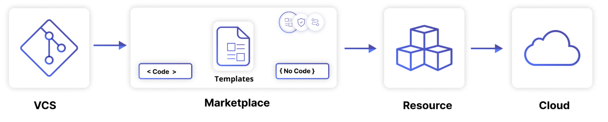
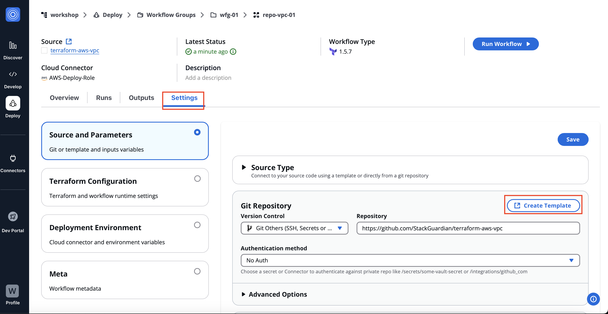
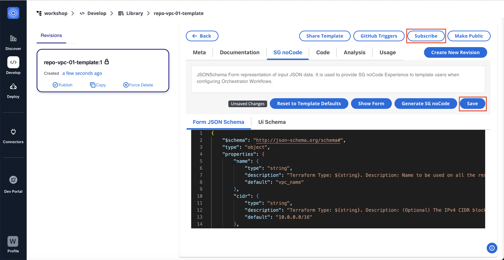

# Usecase 3 - Templates & NoCode

## Overview - What's in the section?
Time: ~20 minutes

In this section, we will begin to make use of the StackGuardian library, which is the home of templates and blueprints. But it is more than that - it also allows you to manage the version and lifecycle of your IaC templates, across different protocols (like Terraform, Ansible Playbooks, Helm Charts etc..), combine multiple templates/protocols into a stack and use NoCode to deploy them. 
The goal of this use-case is to demonstrate the following:

* Standardize on blueprints and templates
* Collaborate between teams in an organisation
* NoCode Interface to simplify deployment of infrastructure
* Versioning and lifecycle of templates



_Fig. Use the marketplace to manage and deploy templates_

## 3.1 - Create an IaC template
### Description
In this lab you will learn how to create a new template from an existing workflow.


### Create an IaC template
Starting point is once again your existing workflow **repo-vpc-xx**. 
Choose the tab **Settings** and **Create Template**.
  
 
_Fig. Create IaC template from existing workflow_  

In the new window provide the following parameters:
1. Template Name = ``vpc-template-xx``
2. The rest of the parameters are prefilled from the workflow (leave them as is)
3. Hit **Create** to add this template to your marketplace.


## 3.2 - Adapt the NoCode interface for your needs
### Description
The NoCode interface is intended to expose only the variables to the cloud consumers which are actually relevant to them. 
This exercise helps you to understand, how you can achieve it with StackGuardian.

### NoCode to enable Self-service
In your newly created template **vpc-template-xx** go to the tab **SG noCode** and open **Show Schemas**. 
Now copy the code below and overwrite the brackets (``{}``) in the **Form JSON Schema**. 

```
{
    "$schema": "http://json-schema.org/schema#",
    "type": "object",
    "properties": {
        "name": {
            "type": "string",
            "description": "Name of the VPC",
            "default": "sg-vpc-xx",
            "title": "VPC name"
        },
        "azs": {
            "type": "string",
            "description": "The region to deploy to",
            "title": "Region",
            "default": "",
            "enumNames": [
                "Frankfurt",
                "Ireland"
            ],
            "enum": [
                [
                    "eu-central-1a",
                    "eu-central-1b"
                ],
                [
                    "eu-west-1a",
                    "eu-west-1b"
                ]
            ]
        }
    }
}

```

Once completed you can choose **Show Form** to see how the interface will look for the endusers. 
Don't forget to **Save & Create New Revision**, which will provide a new version of the template on the left hand side. 
Also **Subscribe** to this template, to make it available for endusers. Before subscribing to it, the template can not be deployed by endusers.

 
_Fig. NoCode interface after adapting it_  

## 3.3 - Deploy your vpc-template via NoCode
### Description
In this exercise you will use the previously created template. 
Put yourself in the shoes of a Cloud Consumer or Developer, who is not too much into IaC syntax. The NoCode interfaces allows also non-IaC-experts to use IaC.

### Deploy infrastructure from template
Change back into the **orchestrator** by going to the left top corner and clicking on the waffle iron (**9dots**).
Hit **Launch Workflow** in the menubar and fill the wizard:

1. Source Type: **Subscribed Templates**
2. Choose a Subscribed Template: ``vpc``
3. Select your **vpc-template-xx** and under template revision the latest revision.
4. The form below should have the following entries
    * VPC Name = ``new-vpc-xx``
    * Region with Availabilty Zones =  _choose one_
5. Click **Next**
---

8. Under Deployment Environment select the connector = **AWS-Deploy-Role**
9. **Next**
---
10. Workflow Group Name = ``wfg-xx``
11. Workflow Name = ``new-vpc-xx`` (this is the name for the resource in the StackGuardian interface)
12. **Next**
---
12. Review the configuration and click **Launch**
---
13. To run the workflow choose the **Terraform Action: Create** and click **Quick Run**
---

In the **Runs** tab you can now follow the deployment. Once the VPC is ready, the Status will change to **Completed**. 

The instructor will show the different capabilities in the marketplace. If you have a usecase in mind, feel free to ask how this can be done in StackGuardian.
