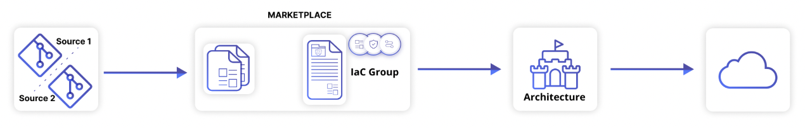
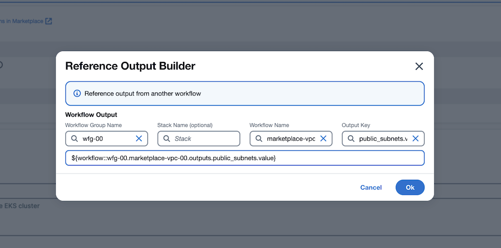
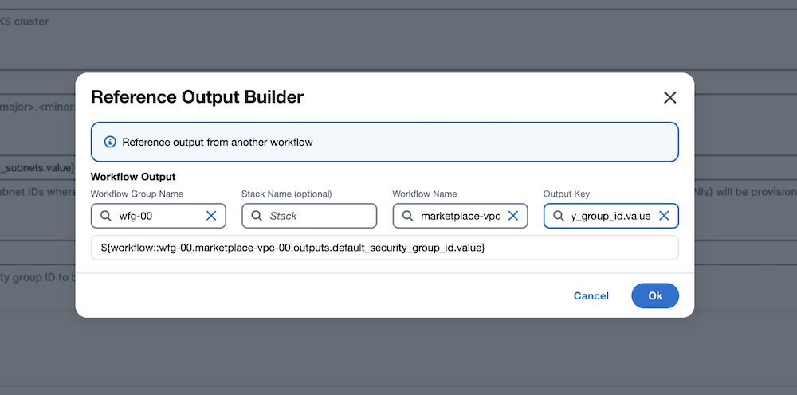

# Usecase 3 - Build Architecture

## Overview - What's in the section?
Time: ~45 minutes  

In this part of the workshop, we are going to show the power of combining multiple templates and protocols into one infrastructure stack. This allows us to build complex architectures and make them available across departments to the whole organisation. No need to reinvent the wheel over and over again. 
To summarise we want to achieve the following:

* Build production-grade architecture
* Combine multiple protocols in a IaC Group
* Deploy the infrastructure stack with NoCode interface
* Self-service for developers and business lines

_Fig. Build Architectures in StackGuardian_

## 3.1 - Closer Look at the EKS cluster IaC Group
### Description
Until now we were only dealing with low level templates which are VPCs, VMs, Storage Account, Resource Group. Now we are arranging them into production-grade infrastructure that allows organisations to standardize their deployments. 

### EKS-Cluster
In the marketplace we will use the predefined IaC Group for EKS-Cluster. Choose **workshop Templates** and **IAC Groups** on the left. Then select the **aws-eks-cluster** IaC Group. 

  
_Fig. IaC Groups in the StackGuardian Marketplace_   

In the tab **Templates** you can see, that this IaC Group consists of three templates: 
* EKS Cluster - Terraform
* EKS Cluster Nodes - Terraform
* NginX Service - Helm Chart

By clicking **Edit Template Defaults** from **terraform-aws-eks-managed-node-group-stripped** you can investigate how the different modules are interconnected. After scrolling down and looking at **Name of existing EKS cluster** the value is a reference to parameter of the previous template in the IaC group. The little wheel on the right hand side helps, to create this reference. 
There are more things to explore but lets get started with the deployment. Close the modal on the top right.

## 3.2 - Deploy the EKS cluster 
### Description
We will use the previously deployed VPC from the marketplace (section 2.2) and deploy the EKS Cluster into it. 

### EKS-Cluster
To deploy the Cluster open the latest revision of the **aws-eks-cluster** IaC Group and click **Create Stack**. 
The following values are to be filled in for the stack - **xx** being your assigned number: 

1. Select Workflow Group = **wfg-xx**
2. Enter Stack Name = ``eks-xx``  
3. Hit **Next**

4. Cluster Name = ``eks-xx`` (xx being your number) 
5. Cluster Version = ``1.25``
6. Subnet IDs for Cluster 
    * **Click little wheel on the right side, next to the textbox**
    * Workflow Group Name = **wfg-xx**
    * Stack Name = _leave empty_
    * Workflow Name = **marketplace-vpc-xx**
    * Output Key = ``public_subnets.value``
    * Click **OK**

_Fig. Subnet IDs for Cluster_

7. Default Security Group ID
    * **Click little wheel on the right side, next to the textbox**
    * Workflow Group Name = **wfg-xx**
    * Stack Name = _leave empty_
    * Workflow Name = **marketplace-vpc-xx**
    * Output Key = ``default_security_group_id.value``
    * Click **OK**

_Fig. Default Security Group ID_

8. Click **Next**

9. Name of Managed Node Group = ``eks-managed-node-xx`` 
10. Subnet IDs for Cluster Nodes
    * Click little wheel next to the textbox
    * Workflow Group Name = **wfg-xx**
    * Stack Name = _leave empty_
    * Workflow Name = **marketplace-vpc-xx**
    * Output Key = ``public_subnets.value``
    * Click **OK**

_Fig. Subnet IDs for Cluster Nodes_

11. Click **Next**

**The K8S_CLUSTER_NAME will be pulled from the previous template and is already prefilled**

12. Click **Next**

13. Hit **Create and Execute Workflows**
14. **Go to created stack**

Well done! After a few seconds the workflow on the right starts running and deploys the EKS cluster. 
A stack automatically chains the workflow with each other, that means when one workflow finishes, it kicks off the next one in row until the whole stack is deployed. 

_Fig. Stack of EKS Cluster being deployed_

**It is time to lay back and let StackGuardian do the work.**
