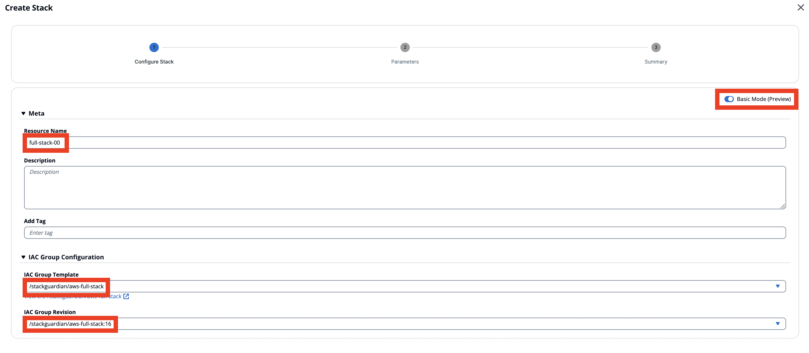

# Usecase 4 - Build Architecture

## Overview - What's in the section?
Time: ~30 minutes  

In this part of the workshop, we are going to show the power of combining multiple templates and protocols into one infrastructure stack. This allows us to build complex architectures and make them available across departments to the whole organisation. No need to reinvent the wheel over and over again. 
To summarise we want to achieve the following:

* Build production-grade architecture
* Combine multiple protocols in a IaC Group
* Deploy the infrastructure stack with NoCode interface
* Self-service for developers and cloud consumers

_Fig. Build Architectures in StackGuardian_

## 4.1 - Closer Look at the full-stack IaC Group
### Description
Until now we were only dealing with low level templates which are VPCs, VMs, Storage Accounts, Resource Groups .... Now we are arranging them into production-grade building-blocks that allows organisations to standardize their deployments. 

### EKS-Cluster
In the marketplace we will use the predefined IaC Group that creates a VPC, EKS-Cluster, Worker-nodes and a webserver. Go to the library, choose **Template Type: IAC Groups**. Then select the **aws-full-stack** IaC Group. 

  
_Fig. IaC Group in the StackGuardian Library_   

In the tab **Templates** you can see, that this IaC Group consists of three templates: 
* VPC Network - Terraform
* EKS Cluster - Terraform
* EKS Cluster Nodes - Terraform
* NginX Service - Helm Chart

Later, with the instructor we will look more in detail, how the single templates are connected to each other and paramaters are passed from one template to the next.

## 4.2 - Deploy the full stack 
### Description
In this exercise we will deploy the stack from the prespective of a cloud consumer, who is not familiar with IaC.

### VPC, EKS-Cluster with Node and Webserver
In the orchestrator and choose your Workflowgroup **wfg-xx**.
Click the tab **Stacks** and afterwards **Create Stack**.

1. Enter the Resource Name = ``full-stack-xx`` (xx being your number)
2. Enable **Basic Mode**
3. Under IAC Group Configuration choose the **/stackguardian/aws-full-stack** and the latest revision
4. Hit **Next**

  
 _Fig. Configure the full stack_   
 
---
5. Meta is already correctly populated with the correct runner info - but you can have a look.
6. In Target Platform Configuration enter the **Connector: AWS-Deploy-Role**
7. In Template Varibale Settings insert
   * VPC name: **vpc-xx**
   * Region: _choose any_
   * Cluster Name: **cluster-xx**
   * Cluster Version: **1.29**
8. Hit **Next**

---

9. Use **Create and Execute Workflows**

Well done! After a few seconds (use refresh button) the first workflow will start running and deploys the first template - the VPC. 
A stack automatically chains the workflows with each other, that means when one workflow finishes, it kicks off the next one in row until the whole stack is deployed. 

_Fig. Full-Stack being deployed_

**It is time to lay back and let StackGuardian do the work.**
The deployment will take about 15min. Time enough to check out the workflows and what is getting created.
