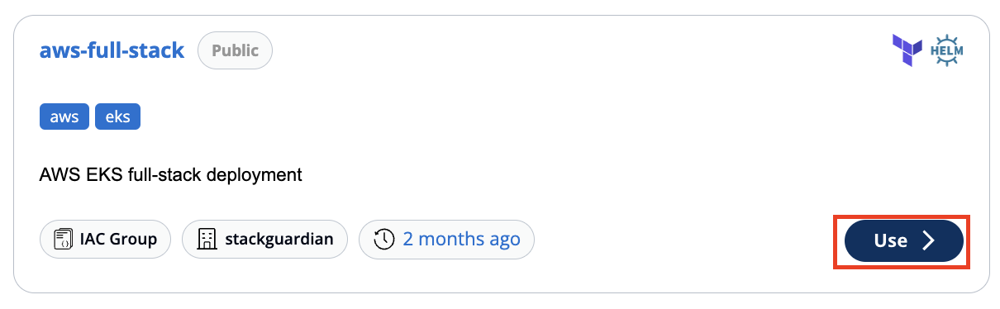
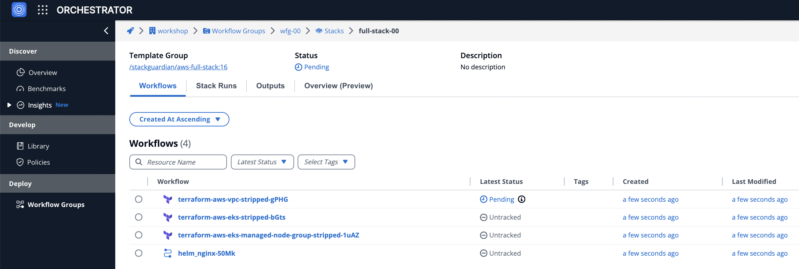
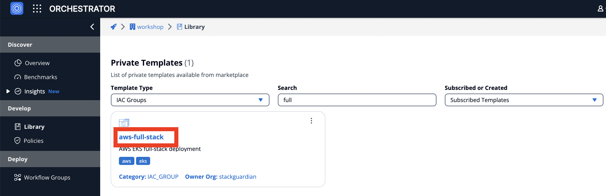

# Usecase 4 - Build Architecture

## Overview - What's in the section?
Time: ~15 minutes  

In this part of the workshop, we are going to show the power of combining multiple templates and protocols into one infrastructure stack. This allows us to build complex architectures and make them available across departments to the whole organisation. No need to reinvent the wheel over and over again. 
To summarise we want to achieve the following:

* Build production-grade architecture
* Combine multiple protocols in a IaC Group
* Deploy the infrastructure stack with NoCode interface
* Self-service for developers and cloud consumers

_Fig. Build Architectures in StackGuardian_

## 4.1 - Deploy the Full-Stack 
### Description
Until now we were only dealing with single level templates which are VPCs, VMs, Storage Accounts, Resource Groups .... Now we are arranging them into production-grade building-blocks, which allows organisations to standardize their deployments. 

### VPC, EKS-Cluster with Worker-Node and Webserver
In the navbar click on **Dev Portal**. This will bring you to the Developer Portal, which allows anybody in the organisation to deploy infrastructure & applications (without Coding experience). 

1. In the **Template Type** dropdown choose **IAC Groups**
2. **Use** the **aws-full-stack**

  
 _Fig. Use aws-full-stack_  

---

3. Workflow Group Name: **wfg-xx**  
4. Stack Name: ``full-stack-xx``. 
Click **Next**.

---

5. In Variable Settings insert:
   * VPC name: **vpc-xx**
   * Region: **Frankfurt**
   * Cluster Name: **cluster-xx**
   * Cluster Version: **1.29**
Click **Next**.

---
  
6. In Deployment Environment enter the **Connector: AWS-Deploy-Role**
7. Hit **Launch**

---

Well done! This is all that is necessary to deploy the whole building-block. After a few seconds (use refresh button) the first workflow will start running and deploys the first workflow - the VPC. 
A stack automatically chains the workflows with each other, that means when one workflow finishes, it kicks off the next one until the whole stack is deployed. 

_Fig. Full-Stack being deployed_

**Now let StackGuardian do the work. The deployment will take about 15min**
In the mean time, check out lab 4.2 and look behind the curtain.

## 4.2 - Closer Look at the Full-Stack IaC Group
### Description
Now we have seen, how simple it can be for the end-user to deploy infrastructure in Self-Service. 
But how are all the single modules/templates connected? How are variables transfered between Terraform and Helm? 

### Full-Stack in Library
Go to the library, choose **Template Type: IAC Groups**. Then select the **aws-full-stack** IaC Group. 

  
_Fig. IaC Group in the StackGuardian Library_   

In the tab **Templates** you can see, that this IaC Group consists of four templates: 
* VPC Network - Terraform
* EKS Cluster - Terraform
* EKS Cluster Nodes - Terraform
* NginX Service - Helm Chart

You can already have a look at the **View Template Defaults** in each of the templates. 
The instructor we will also take a closer look at the teampletes with the whole group. 

