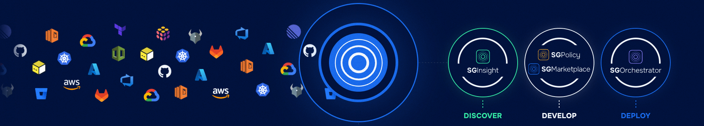

# Summary + Feedback

Congratulations, you have completed the StackGuardian Hands-On Workshop!  Throughout the day we created 
* A pipeline deployment
* Created templates and adapted them to the specific needs
* Crafted complex architectures to standardize the organisations infrastructure
* Introduced Tirith policies and used them to guardrail deployments

We are happy that you joined us today! Please leave your feedback so we learn from you, what was good and which parts we can improve: https://docs.google.com/forms/d/1FzVmRmvnpPda97HQxBl_KXDH9RMu7a9d745lS3LqgMY 

* [SG Documentation](https://docs.stackguardian.io/docs)
* [SG API](https://docs.stackguardian.io/api)
* [SG LinkedIn](https://www.linkedin.com/company/stackguardian/mycompany/)

